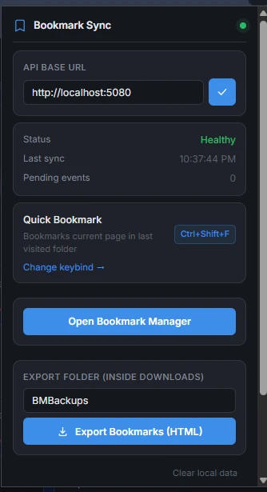

# Bookmark Manager Sync (Extension)

Manifest V3 extension for Brave/Chrome that keeps a bookmark folder in real-time two-way sync with the [Bookmark Manager](../README.md) server, and adds a few things the native bookmarking flow doesn't: an in-tab command palette, an address-bar (`bm`) search keyword, episode/chapter auto-extraction, and a quick-bookmark hotkey.



## Build

```bash
npm install
npm run build
```

Output goes to `dist/`. Other scripts:

```bash
npm run watch      # rebuild on file change
npm run typecheck  # tsc --noEmit
npm run lint       # eslint .
npm test           # vitest run
```

## Load into Brave/Chrome

1. `npm run build` (produces `dist/`).
2. Go to `chrome://extensions` (or `brave://extensions`), enable **Developer mode**.
3. **Load unpacked** → select `BookmarkExtension/dist`.
4. Open the extension popup, set the **API Base URL** to your server, and connect. This is a free-text field you use to switch between a local dev server (`http://localhost:5080`) and the real deployment — for a deployment with the [in-tab command palette's TLS](../Docs/deployment-ubuntu.md#tls-for-the-in-tab-command-palette-optional) set up, use the server's stable Tailscale MagicDNS name, e.g. `https://<machine>.<tailnet>.ts.net:8443`, since it stays correct even if the server's LAN IP changes. You'll be prompted for host permission for that origin — that's the only host access the extension ever requests, and only for the server you point it at.

See [Docs/quickstart.md](../Docs/quickstart.md) for the full setup flow alongside the server.

## What it does

- **Two-way sync** — background service worker holds a WebSocket to the server, claims and executes server-issued commands (`chrome.bookmarks` create/move/delete/reorder), and reports outcomes back.
- **In-tab command palette** — injected into every page (`http://*/*`, `https://*/*`) to search/launch bookmarks without leaving the current tab. Default shortcut is `Ctrl+Shift+P`; rebind to `Ctrl+P` at `chrome://extensions/shortcuts` to match the dashboard's own palette shortcut.
- **Address-bar search** — type `bm` + space in the omnibox to search and launch bookmarks.
- **Quick bookmark** — `Ctrl+Shift+F` bookmarks the current tab into the last-used folder, with duplicate-series detection for tracked anime/manga/novels.
- **HTML export** — manual Netscape-format bookmark export to Downloads, independent of the server's own SQLite backups.

## Permissions

| Permission | Why |
|---|---|
| `bookmarks` | Read/write the browser's bookmark tree for sync. |
| `storage` | Local settings, sync state, outbox queue. |
| `alarms` | Periodic heartbeat/sync ticks. |
| `tabs`, `activeTab`, `scripting` | Quick-bookmark and in-tab command palette injection. |
| `downloads` | HTML bookmark export. |
| `notifications` | Sync error/status notifications. |
| `optional_host_permissions` (`http://*/*`, `https://*/*`) | Requested on-demand, scoped to whichever server URL you configure — never requested at install time. |

## Project layout

```
src/
  api/        API client + typed contracts shared with the request/response shapes
  background/ Service worker: sync loop, WebSocket, command execution, alarms
  backup/     HTML export (Netscape format) to Downloads
  bookmarks/  chrome.bookmarks adapter, duplicate-series detection
  commands/   Keyboard command handlers (quick-bookmark, toggle-palette)
  palette/    In-tab command palette (content script + host page)
  popup/      Extension popup UI (connection settings, status, shortcuts)
  storage/    chrome.storage.local repository, URL validation
tests/        Mirrors src/, vitest + a mock server for integration-style tests
```

## Testing

```bash
npm test
```

Tests run against `chrome.storage`/`chrome.bookmarks` fakes (see `tests/helpers/`) and a local mock server (`tests/mock-server.mjs`) — no live Bookmark Manager instance required.
