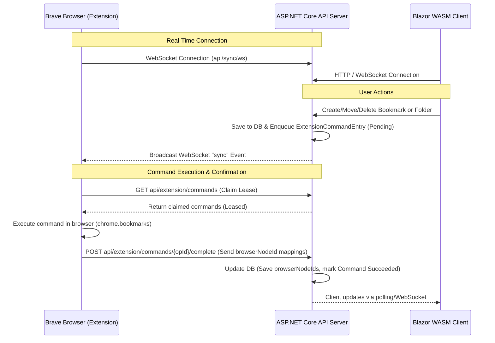

# Project System Map & Agent Context Guide

This document provides a comprehensive technical overview of the Bookmark Manager project, designed to help AI coding agents quickly build context, locate key components, and understand the synchronization protocols and algorithms.

## 🚀 Features Overview

- **Brave Browser Sync**: Real-time two-way synchronization of selected bookmark folders using heartbeats, snapshot uploads, and client-claimed command queues.
- **1:1 Sync Fidelity**: Automatic detection and soft-deletion of server-side orphan bookmarks and duplicate folders to match Brave's directory configuration.
- **Global Undo Stack**: Stack-based undo mechanism with SnackBar triggers that revert deletes, moves, and drag-and-drop actions.
- **Anime/Manga Episode Auto-Extraction**: Extension automatically parses episode/chapter values from query parameters (`?ep=10`), URL paths (`/chapter-5/`), or DOM elements and appends them to bookmark titles.
- **Search Omnibox Integration**: Inline address-bar search from Brave by typing `bm` + space/tab to filter and launch bookmarks.
- **Stale Bookmarks Review**: A `/stale` page to browse, Keep (refresh timestamp), Archive (move to dynamic Archive folder), or Delete untouched/old links.
- **Broken Link Checker**: Background worker querying active URLs for DNS failures, timeouts, and 404s, moving them to a `"Broken Links"` folder with sync creation safeguards.
- **AI Auto-Tagging**: Offline TF-IDF keywords and rule-based site categorization suggesting tags inside the bookmark editor.
- **Database Backups**: Server-side SQLite snapshots via `VACUUM INTO` to `/data/backups/db`; create, download, delete, and restore from the `/backups` dashboard page (restore applies on next API restart).
- **Safety Database Purging**: Scheduled daily purging of Recycle Bin items older than 30 days, backed by a separate safety JSON archive under `/data/backups/purged/` (not the same as DB snapshots).
- **Library Discovery**: Browse and search a locally-cached catalog of anime, manga, and novels sourced from AniList, MangaDex, Kitsu, RanobeDB, Novelfire, RoyalRoad, and NovelUpdates, with a details popup per title (cover, synopsis, tags, source link).

---

## 🏗️ System Architecture & Sync Loop

The application consists of three main components: a **Brave/Chrome Sync Extension**, an **ASP.NET Core API Server**, and a **Blazor WebAssembly Dashboard**. The extension and server maintain a 1:1 state projection of tracked browser folders.

### 1. Synchronization Protocol
- **Extension Heartbeats**: The extension polls `POST api/extension/heartbeat` periodically, transmitting client status (Offline/Online), configuration versions, and claims pending sync actions.
- **Snapshot Uploads**: If the server configuration changes (e.g., a new root folder is tracked), the extension uploads a complete snapshot tree of the tracked root folder (`POST api/extension/snapshots`).
- **Command Leases**: Server-initiated edits (moves, deletes, creation) are enqueued in the `ExtensionCommands` table. The extension claims leases, executes the commands browser-side using `chrome.bookmarks` APIs, and reports success back via `/complete` along with browser-side ID mappings.

---

## 📁 Key File Map

### Extension (TypeScript / Manifest V3)
- 📄 [manifest.json](file:///c:/Users/Pham2/source/repos/BookmarkManager/BookmarkExtension/manifest.json) — Defines MV3 settings, quick-keys, scripting tab permissions, and the `bm` search omnibox keyword.
- 📄 [service-worker.ts](file:///c:/Users/Pham2/source/repos/BookmarkManager/BookmarkExtension/src/background/service-worker.ts) — Background script orchestrating websocket loops, alarm tasks, heartbeat checks, quick-bookmark hotkeys, and address-bar search listeners.
- 📄 [bookmark-adapter.ts](file:///c:/Users/Pham2/source/repos/BookmarkManager/BookmarkExtension/src/bookmarks/bookmark-adapter.ts) — Translates incoming server payloads into browser API calls (`chrome.bookmarks.create`, `move`, `remove`, `applyRestore` [recursive]).

### Server API (C# / .NET 10)
- 📄 [Program.cs](file:///c:/Users/Pham2/source/repos/BookmarkManager/src/BookmarkManager.Api/Program.cs) — Services registration (SQLite connection, `LinkCheckerService`, design protection, WebSocket router).
- 📄 [AppDbContext.cs](file:///c:/Users/Pham2/source/repos/BookmarkManager/src/BookmarkManager.Api/Data/AppDbContext.cs) — Configures EF Core models, index keys, and cascade/restrict deletes.
- 📄 [BookmarksController.cs](file:///c:/Users/Pham2/source/repos/BookmarkManager/src/BookmarkManager.Api/Controllers/BookmarksController.cs) — Handles CRUD, favorites, batch-delete, stale bookmarks retrieval, and manual link checker execution triggers.
- 📄 [ExtensionService.cs](file:///c:/Users/Pham2/source/repos/BookmarkManager/src/BookmarkManager.Api/Services/ExtensionService.cs) — Ingests snapshot uploads, compares state, and soft-deletes orphan records.
- 📄 [LinkCheckerService.cs](file:///c:/Users/Pham2/source/repos/BookmarkManager/src/BookmarkManager.Api/Services/LinkCheckerService.cs) — Background worker checking bookmarks for dead URLs.

### Client UI (C# / Blazor WebAssembly)
- 📄 [Bookmarks.razor.cs](file:///c:/Users/Pham2/source/repos/BookmarkManager/src/BookmarkManager.Client/Pages/Bookmarks.razor.cs) — Main dashboard workspace controller (drag-drop, context menus, favorites pinning, search).
- 📄 [Stale.razor](file:///c:/Users/Pham2/source/repos/BookmarkManager/src/BookmarkManager.Client/Pages/Stale.razor) — Shows unvisited/untouched links based on historical dates.
- 📄 [BookmarkEditDialog.razor](file:///c:/Users/Pham2/source/repos/BookmarkManager/src/BookmarkManager.Client/Components/BookmarkEditDialog.razor) — Form for editing bookmarks with offline tag suggestions.
- 📄 [UndoService.cs](file:///c:/Users/Pham2/source/repos/BookmarkManager/src/BookmarkManager.Client/Services/UndoService.cs) — Stack-based global undo manager.

---

## 🗄️ Database Schema & Entities

- **`BookmarkNode`**: Represents bookmarks and folders.
  - Key columns: `Id`, `ParentId`, `Type` (Folder/Bookmark), `Title`, `Url`, `Position`, `IsDeleted`, `UpdatedAt`, `BrowserNodeId` (the browser-side ID string), `ParentBrowserNodeId`.
  - Metadata columns: `Tags` (comma-separated string), `Category`, `Notes`, `IsFavorite`.
- **`ExtensionCommandEntry`**: Stores queued sync actions.
  - Columns: `Id`, `OperationId`, `CommandType` (Create/Move/Delete/Reorder/Restore), `BookmarkId`, `BrowserNodeId`, `PayloadJson`, `Status` (Pending/Leased/Succeeded/Failed).
- **`TrackedRoot`**: Defines root folders sync scopes.
  - Columns: `Id`, `Title`, `BrowserNodeId`, `LastSyncedAt`.
- **`LibraryCatalogEntry`**: Local mirror of one provider title, populated by the catalog sync background service so the Library "Browse" view can page through the full catalog instead of a live top-N call.
  - Columns: `Id`, `Provider`, `ProviderId` (unique together), `Title`, `AlternateTitles`, `Authors`, `MediaType`, `CoverImageUrl`, `Synopsis`, `Genres`, `Rating`, `Status`, `LatestChapter`, `LatestVolume`, `LastReleaseAt`, `SourceUrl`, `PopularityRank`, `FirstImportedAt`, `LastRefreshedAt`.
- **`LibraryCatalogSyncQueueItem`**: Durable work queue (Queue-Based Load Leveling) — one row is one "fetch the next page" step of a provider crawl sequence, so a restart mid-crawl resumes instead of losing progress.
  - Columns: `Id`, `Provider`, `MediaTypeQuery`, `ContinuationToken`, `RemainingPages`, `Status` (Pending/Processing/Done/Failed), `Attempts`, `LastError`, `CreatedAt`, `NextAttemptAt`.
- **`TagProvenance`**: Records which source supplied each tag on a bookmark (cross-provider attribution for the tag tooltip and reruns panel). All rows for a bookmark are replaced as a unit on every tag write (auto-tag run, rerun, manual save) via `TagProvenanceWriter`.
  - Columns: `Id`, `BookmarkId` (indexed; composite index with `Tag`), `Tag`, `Provider` (AniList/Kitsu/MangaUpdates/NovelFull/Catalog/DomainRoute/Manual), `Confidence` (AI series-identification confidence for the run, null for deterministic/manual), `CreatedAt`.

---

## ⚙️ Core Algorithms & Safeguards

### 1. 1:1 Sync Fidelity Comparison (ExtensionService)
- Retrieves all currently active (non-deleted) database nodes under the uploaded tracked root.
- Compares database nodes with incoming extension snapshot records.
- Any database node missing from the snapshot is marked as soft-deleted (`IsDeleted = true`, `DeletedAt = UtcNow`, `PurgeAfter = UtcNow + 30 days`).

### 2. Library Catalog Sync — Queue-Based Load Leveling (LibraryCatalogSyncBackgroundService)
- Mirrors AniList/MangaDex/RanobeDB/Novelfire catalogs into `LibraryCatalogEntry` so Browse pages through thousands of titles instead of a 24-title live top-N call.
- Each "fetch next page" step is a durable `LibraryCatalogSyncQueueItem` row, not in-memory state — a container restart mid-crawl resumes exactly where it left off.
- One worker loop per bulk-capable provider, throttled by that provider's existing rate limiter (shared with live search/trending, so the crawl never starves interactive requests).
- Failed pages get exponential backoff and a max attempt count before landing in a `Failed` state for inspection in Settings; a stalled sequence (next token == current token) self-terminates instead of looping forever.

### 3. Safeguarded Folder Creation Deferral (LinkCheckerService)
- When scanning, if a `"Broken Links"` folder doesn't exist, it is created in the DB and enqueued as a browser `Create` command.
- Moving detected dead links to the `"Broken Links"` folder is **deferred** in the database until the browser confirms the folder's creation and reports its `BrowserNodeId` back to the server. This prevents out-of-order execution errors inside the extension command loop.

### 4. Rule-Based Offline Tag Suggestion (TagExtractorService)
- Strips standard English stop words from the bookmark title.
- Maps titles containing signature substrings (like `"github"`, `"miruro"`, `"mangadex"`) to standard categories (`Development`, `Anime`, `Manga`, `News`, `Shopping`).
- Selects the top 5 most common keywords and lists them as click-to-add chip suggestions.
- Saves tags in the DB by serializing the list as a comma-separated string, mapped back via AutoMapper.

### 5. Safety Purge Backup (PurgeBackgroundJob)
- Database purge operations run daily, deleting nodes that have been in the Recycle Bin for more than 30 days.
- Before removing records from the DB, the background job serializes the target records into a safety backup JSON file in `/data/backups/purged/` so that mistakes can be manually recovered if necessary. This is separate from full-database snapshots (see §6).

### 6. Database Backup (BackupService / BackupBackgroundJob)
- **Snapshots:** `BackupService` creates compact standalone `.db` files with SQLite `VACUUM INTO` under `/data/backups/db` (Docker volume `/data`, local-dev fallback under the app base directory). Never file-copy a live WAL database.
- **Manifests:** Each run inserts a `BackupManifests` row (`Status`, `Trigger`, content stats, duration, error). `FilePath` is server-only and never returned to the client.
- **Schedule:** `BackupBackgroundJob` runs nightly at `03:00` Europe/Berlin by default (override via `Backup:ScheduleTime` / `Backup:TimeZoneId` in `appsettings.json`). Manual **Back up now** from `/backups` uses the same pipeline. Retention defaults: 30 files / 60 days.
- **Restore (restore-on-restart):** UI restore requires typing `RESTORE`. The API takes a pre-restore safety snapshot (`Trigger=PreRestore`), verifies the chosen snapshot, then stages `restore-pending.db` beside the live DB. On the next process start, `BackupPendingRestore.ApplyPendingRestoreIfAny` swaps the file **before** EF Core opens a connection. Startup bumps `ConfigVersion` and sets a repair marker so the extension uploads a full Repair snapshot and re-baselines sync.
- **Extension HTML export:** `BookmarkExtension/src/backup/backup-manager.ts` still exports Netscape HTML to Downloads for browser import/interop. It is not the primary durability story — use the server `/backups` page for full SQLite recovery.
